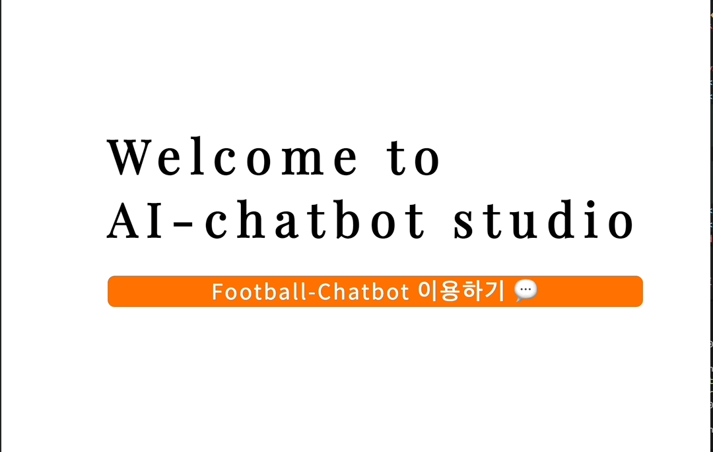
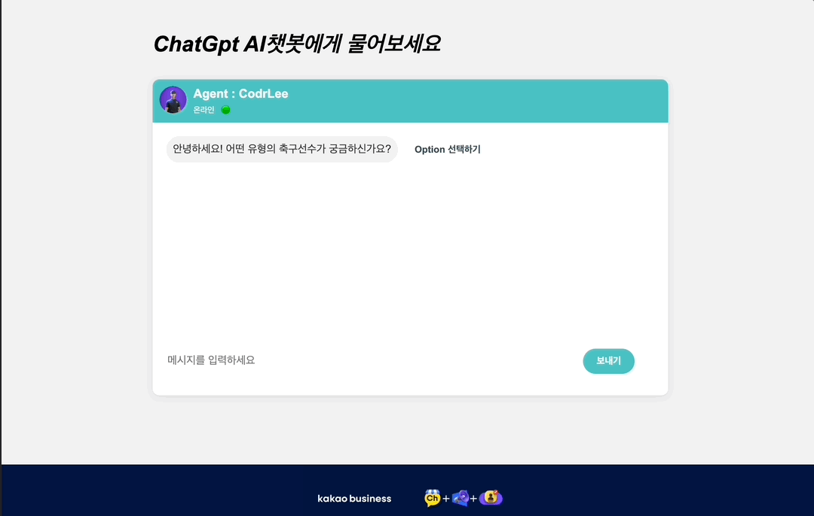
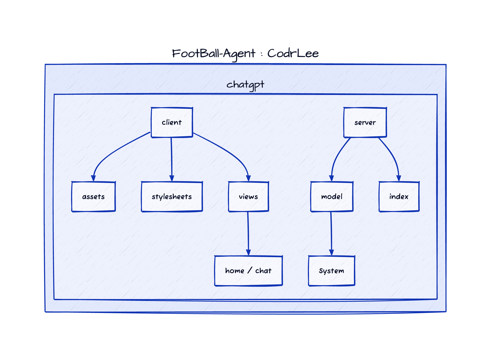

# "KickMaster: AI-Powered Recommendations for World-Class Soccer Players"

ChatGpt 3.5 turbo model을 이용한 <b>인공지능 축구 선수 추천 서비스 웹</b>입니다.
직접 물어볼 수도 있고, 세계의 각 리그와 포지션, 연도까지 세부 옵션을 직접 선택하면
자동적으로 옵션에 맞는 선수를 추천해주는 것이 특징입니다.

##

### 💻 프로젝트 이미지

1. 홈 화면
 

    
 

2. 채팅 화면(옵션)
 

    
  

3. 채팅 화면(일반)
 

    
  

##

### 🌐 프로젝트 링크

https://football-agent-ai.pages.dev/

-   현재 SSR 배포 문제로 인해 Build v.1.0 버전으로 Roll-back한 상태입니다.
-   모바일로 접속 시, 최소 크기로 인해 가로화면으로 이용해주십시오

##

### ⚙️ 개발 환경

-   언어 : JavaScript(ES6+), HTML(Ejs), CSS, Node.js
-   라이브러리 : npm, express, ejs, openai, serverless-http ...
-   배포

1. Front-End : CloudFlare
2. Back-End : AWS Lambda

##

### ✅ 기능 설명

-   Chat
    -   chatting UI를 제공하므로서 챗봇임을 사용자에게 확실하게 인지
    -   Option 선택하기를 만들어서 좀 더 쉽게 서비스를 이용할 수 있도록 유도
-   System
    -   openai를 사용해서 chatGpt-Ai 기능 사용
    -   input, output 각각 요청, 응답 기능 구현
    -   요청 응답 메시지 순차적으로 연결
    -   비정상적인 공백 및 이상한 형태의 문자 출력 방지
    -   잘못된 요청으로 인한 앱 종료 방지

##

### 🔆 프로젝트 구조

### 🙇‍♂️ 프로젝트를 통해 배운 것들

-   openai의 사용법과 openai안에 세부 기능들을 공식 홈페이지를 통해 공부하면서 AI에 대한 동작원리와 chatGpt가 제공하는 알고리즘을 학습할 수 있는 계기가 되었습니다

-   서버에서 클라이언트 간의 데이터 호출과 비동기 처리에 대해 가장 고민을 많이 했었습니다. 특히 클라이언트에서 세부 옵션을 정하고 서버에 req.body에 넣어줄 때 막히는 부분이 많아서 수차례 시도를 거치며 해결할 수 있었습니다

-   기능고도화에 대한 UI, UX부분에 대한 공부를 할 수 있었습니다. chatGpt 이용 시 전달하는 메시지가 가끔 이상한 형태로 전달이오고 메시지를 연속으로 보내면 답변이 꼬일 경우가 있었는데 이를 해결하는 과정에서 유저에게 전달할 UI, UX를 신경쓰게 되었습니다.

-   프로젝트에 수익화할 수 있는 방법을 처음 시도한 프로젝트였습니다. 수익화에 대한 부분을 생각하면서 좀 더 사용자 측면에서 어떤 부분을 원하고 어떻게 해야 수익을 이끌어낼 수 있는지 고민할 수 있었던 좋은 경험이었습니다

-   배포 시, Node 버전이 일치하지 않는 문제로 Node 버전을 다운그레이드 하면서 프로젝트를 재정비한 경험이 있습니다. 이 때 환경변수를 직접 설정을 통해서 기존 프로젝트에서 지원하지 않는 부분을 다뤄볼 수 있는 좋은 경험이었습니다

-   AWS Lambda에 서버를 배포하면서 해결하지 못한 부분이 있었습니다. local에서는 SSR이 잘 되었으나, 배포 시 람다함수의 디렉터리에서 찾지 못 하는 문제를 마주치게 되었고 에러를 해결하기 위해 빌드한 것을 단순화해서 롤백 후 처리를 위해 노력 중입니다

## 🌟 디벨롭 예정 리스트

-   서버리스 환경인 AWS Lambda에 Express와 EJS 애플리케이션을 배포 (AWS CLI 설정, API Gateway 생성) 예정입니다
-   MERN stack으로 실제 데이터베이스를 사용해서 openai 프로젝트 디벨롭 예정입니다
